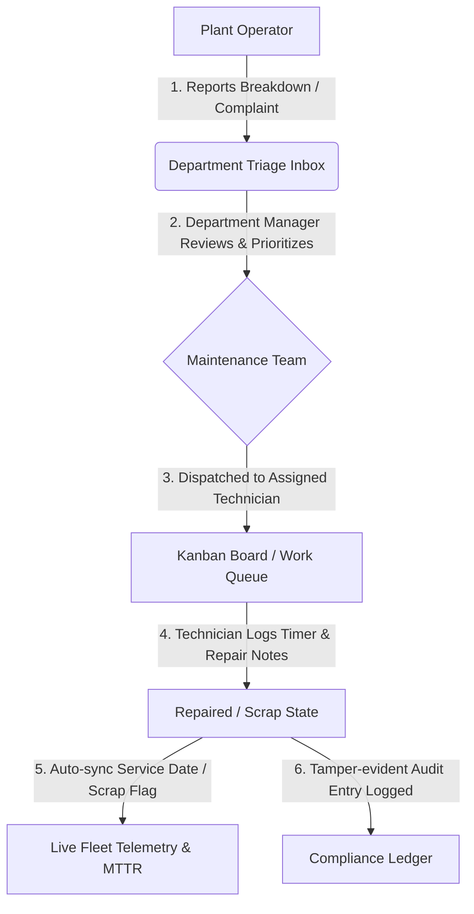

# ⚙️ GearGuard – Intelligent Industrial Asset Maintenance & Telemetry ERP

> **Empowering Modern Smart Factories with Zero-Unplanned-Downtime Reliability.**  
> Inspired by enterprise ERPs like Odoo, GearGuard bridges physical plant machinery, shopfloor technicians, department superintendents, and reliability engineering workflows into a cohesive, high-performance web platform.

---

## 📺 Project Walkthrough
🎥 **[Watch the Loom Video Demo](https://www.loom.com/share/cf38a46e897c4508a00ad83d5d006aff)**

---

## 🌟 What's New in v2.0 Enterprise

* **🚀 Modern Interactive Landing Page**: A landing page at `http://localhost:3000` with live plant telemetry indicators, an interactive 6-department explorer, and **1-Click Demo Login Launchpads** for instant role switching without typing credentials.
* **🏭 6 Industrial Plant Divisions**: Full departmental isolation across **Machining**, **Production**, **Assembly**, **Facilities**, **Logistics**, and **Quality Control**.
* **✨ Frosted-Glass Modal Popups**: Centered dialog overlays with backdrop blur (`backdrop-filter: blur(8px)`) and spring pop-in animations across all creation forms, complaint tickets, and deletion confirmations.
* **📦 81 Pre-Configured Enterprise Assets**: CNC 5-axis mills, robotic articulated arms, heavy press brakes, industrial boilers, reach pickers, and CMM metrology stations.
* **📋 110 Historical & Active Work Orders**: High-density timeline of breakdown complaints, preventive calibrations, and technician repair durations.
* **🔐 Strict Departmental RBAC**: Machine department complaints and asset requests are strictly scoped to their respective department managers (e.g., Machining Manager only sees Machining issues).

---

## 🚀 Key Modules & Architecture

* **Command Center & Fleet Telemetry**: Real-time MTTR (Mean Time to Repair), MTBF (Mean Time Between Failures), downtime expense distribution, and high-risk equipment alerts calculated via aggregation pipelines.
* **Shopfloor Work Queue & Kanban**: Drag-and-drop tickets across `New Request` ➔ `In Progress` ➔ `Repaired` or `Scrap`, complete with live technician repair timers and resolution logs.
* **Smart Equipment Catalog & Odoo Buttons**: Deep serial tracking, warranty dates, location mapping, and live badge counters linking maintenance histories directly on equipment forms.
* **Machine Custody & Storage Return**: Self-service machine checkout for plant operators, department manager budget approvals, and custody return handovers.
* **Operator Complaint Triage**: Operators report equipment malfunctions directly from their mobile/desktop terminals with severity ratings and component failure descriptions.
* **Tamper-Evident Audit Ledger**: Immutable compliance trail capturing user IDs, timestamps, entity diffs, state transitions, and technician leaderboards.

---

## 🛠️ Technology Stack

### Frontend Tier
* **Framework**: [Next.js 16](https://nextjs.org/) (App Router, React 19)
* **Language**: TypeScript
* **State & Caching**: TanStack React Query v5
* **Styling**: Vanilla CSS Design Tokens with Dark/Light Theme Switching
* **UI Components**: Radix UI Primitives, Lucide React Icons
* **Data Visualization**: Recharts

### Backend Tier
* **Framework**: [FastAPI 2.0](https://fastapi.tiangolo.com/) (Python 3.10+)
* **Database Driver**: [Motor](https://motor.readthedocs.io/) (Async MongoDB Driver)
* **ODM**: [Beanie ODM](https://beanie-odm.dev/) (Pydantic v2 document models)
* **Security & Auth**: JWT in secure HTTP-only cookies, SlowAPI rate limiting, Argon2/BCrypt hashing
* **Interactive Docs**: Swagger UI (`/api/docs`) & OpenAPI 3.1

---

## ⚡ Quick Start: Running GearGuard Locally

GearGuard runs with the **FastAPI Backend** on port `3001` and the **Next.js Frontend** on port `3000`.

### 1️⃣ Start the Backend (FastAPI)

```bash
cd gearguard-backend

# 1. Create and activate a Python virtual environment
python -m venv venv

# Windows PowerShell:
.\venv\Scripts\activate

# macOS / Linux:
source venv/bin/activate

# 2. Install dependencies
pip install -r requirements.txt

# 3. Configure .env (ensure MongoDB Atlas connection string is set)
# DATABASE_URL=mongodb+srv://...
# PORT=3001

# 4. (Recommended) Seed database with 81 assets, 47 users, and 110 work orders
python -m app.seed

# 5. Start the backend server
python main.py
```

* **API Base URL**: `http://localhost:3001`
* **Interactive Swagger Docs**: [http://localhost:3001/api/docs](http://localhost:3001/api/docs)
* **OpenAPI Schema**: [http://localhost:3001/api/openapi.json](http://localhost:3001/api/openapi.json)

---

### 2️⃣ Start the Frontend (Next.js)

Open a second terminal window:

```bash
cd gearguard-frontend

# 1. Install npm packages
npm install

# 2. Start development server
npm run dev
```

* **Frontend Web App & Landing Page**: [http://localhost:3000](http://localhost:3000)
* **Direct Operator Sign In**: [http://localhost:3000/login](http://localhost:3000/login)

---

## 👥 Demo Personas & Test Credentials

> **Master Password for ALL Demo Accounts:**  
> ### `password123`

For testing different operational perspectives, use the pre-configured accounts below:

| Role | Email | Password | Scope & Access Highlights |
| :--- | :--- | :--- | :--- |
| **Super Admin** | `admin@gearguard.com` | `password123` | Plant-wide unconstrained access, staff registry, category & location management. |
| **Machining Manager** | `manager.machining@gearguard.com` | `password123` | Machining division oversight, CNC spindle work orders, asset procurement approvals. |
| **Production Manager** | `manager.production@gearguard.com` | `password123` | Press & laser cutting oversight, complaint inbox triage, plant MTTR metrics. |
| **Production Technician** | `tech.production@gearguard.com` | `password123` | Active breakdown queue, Kanban transitions, repair timer logging. |
| **Plant Operator** | `priyanshuc675@gmail.com` | `password123` | Assigned press brakes & laser cutters, breakdown reporting, custody returns. |
| **Standard Operator** | `employee@gearguard.com` | `password123` | Chemical pumps & injection molders self-service, complaint submission. |
| **Compliance Auditor** | `auditor@gearguard.com` | `password123` | Read-only inspection of tamper-evident audit logs, calibration records, and ledger. |

> 📖 **Full Credentials Directory**: For the complete directory of all 47 demo accounts across all 6 departments with assigned machinery and test workflows, see **[CREDENTIALS.md](./CREDENTIALS.md)**.

---

## 🔄 Core Operational Workflow



1. **Breakdown Reporting**: An operator on the factory floor notices pressure drop on an assigned press brake and files a complaint with high severity.
2. **Departmental Scoping**: The ticket routes strictly to that specific division manager for review and technician dispatch.
3. **Kanban Lifecycle**: The technician drags the card to *In Progress*, records diagnostic comments, and completes the work.
4. **Automated State Synchronization**: Setting the ticket to *Repaired* automatically updates the asset's `last_service_date`. If marked *Scrap*, the equipment is flagged unusable plant-wide.
5. **Continuous Intelligence**: The Command Center updates MTTR and MTBF charts in real-time, providing actionable reliability metrics to plant leadership.

---

## 📜 License

This project was built for educational and demonstration purposes. All rights reserved.